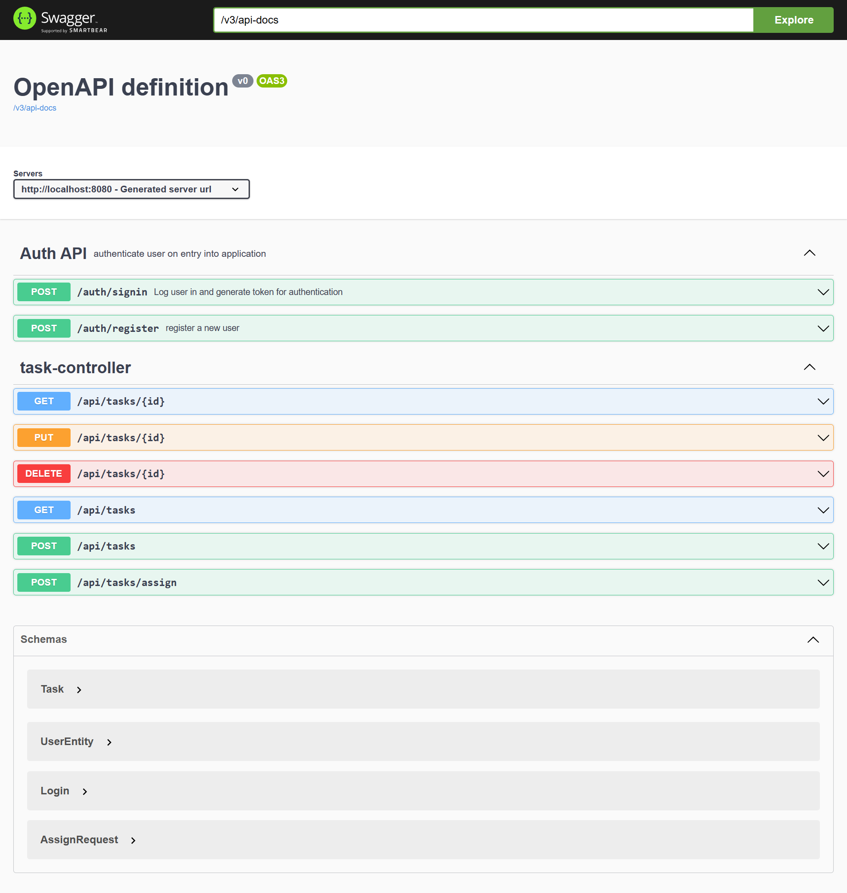

<a name="readme-top"></a>

<!--
!!! IMPORTANT !!!
This README is an example of how you could professionally present your codebase.
Writing documentation is a crucial part of your work as a professional software developer and cannot be ignored.

You should modify this file to match your project and remove sections that don't apply.

REQUIRED SECTIONS:
- Table of Contents
- About the Project
  - Built With
  - Live Demo
- Getting Started
- Authors
- Future Features
- Contributing
- Show your support
- Acknowledgements
- License

OPTIONAL SECTIONS:
- FAQ

After you're finished please remove all the comments and instructions!

For more information on the importance of a professional README for your repositories: https://github.com/microverseinc/curriculum-transversal-skills/blob/main/documentation/articles/readme_best_practices.md
-->

<!-- TABLE OF CONTENTS -->

# 📗 Table of Contents

- [📖 About the Project](#about-project)
  - [🛠 Built With](#built-with)
    - [Tech Stack](#tech-stack)
    - [Key Features](#key-features)
    <!-- - [🚀 Live Demo](#live-demo) -->
- [💻 Getting Started](#getting-started)
  - [Prerequisites](#prerequisites)
  - [Setup](#setup)
  - [Install](#install)
  - [Usage](#usage)
    <!-- - [Run tests](#run-tests) -->
    <!-- - [Deployment](#deployment) -->
- [👥 Authors](#authors)
<!-- - [🔭 Future Features](#future-features) -->
- [🤝 Contributing](#contributing)
- [⭐️ Show your support](#support)
- [📝 License](#license)

<!-- PROJECT DESCRIPTION -->

# 📖 TASKS TRACKER <a name="about-project"></a>

This is an application for organizing, storing and assigning tasks. Login and Sign up features were implemented

## 🛠 Built With <a name="built-with"></a>

### Tech Stack <a name="tech-stack"></a>

> Major technologies used in this project:

<details>
  <summary>Server</summary>
  <ul>
    <li><a href="https://tomcat.apache.org/">Tomcat</a></li>
  </ul>
</details>

<details>
<summary>Database</summary>
  <ul>
    <li><a href="https://www.h2database.com/">H2</a></li>
  </ul>
</details>

<!-- Features -->

### Key Features <a name="key-features"></a>


> These are key features of this project.

- **CRUD(create,read,update,destroy) actions on taskss**
- **assign task to a user**

<p align="right">(<a href="#readme-top">back to top</a>)</p>

<!-- LIVE DEMO

## 🚀 Live Demo <a name="live-demo"></a>

> Add a link to your deployed project.

- [Live Demo Link](https://google.com)

<p align="right">(<a href="#readme-top">back to top</a>)</p> -->

<!-- GETTING STARTED -->

## 💻 Getting Started <a name="getting-started"></a>

To get a local copy up and running, follow these steps.

### Prerequisites

In order to run this project you need:

- Spring boot
- java
- sql
- maven
<!--
Example command:

```sh
 gem install rails
```

-->

### Setup

Clone this repository to your desired folder:

```sh
  cd my-folder
  git clone git@github.com:tylher/task-tracker.git
```

### Install

Install this project with:

> Open the cloned project on Intellij IDE and hit the run button to spin up Tomcat server and database.

<!--
Example command:

```sh
  cd my-project
  gem install
```
--->

### Usage

To run the project, execute the following command:

> Test the API end points on API clients such as RapidAPI, Postman etc.

To run read documentation for each endpoints :

> Navigate to <a href="localhost:8080/swagger-ui/index.html"> localhost:8080/swagger-ui/index.html</a><br>
> input "/v3/api-docs" in the explore search box



<p align="right">(<a href="#readme-top">back to top</a>)</p> -->

## 👥 Authors <a name="authors"></a>

👤 <a href="https://github.com/tylher" target="blank"></a> **Taiwo Damola Adediran**

- GitHub: [@tylher](https://github.com/tylher)
- Twitter: [@tylher123](https://twitter.com/tylher123)
- LinkedIn: [Taiwo Adediran](https://www.linkedin.com/in/taiwo-adediran-327654127/)

<p align="right">(<a href="#readme-top">back to top</a>)</p>

<!-- FUTURE FEATURES -->

<!-- ## 🔭 Future Features <a name="future-features"></a>

> Describe 1 - 3 features you will add to the project.

- [ ] **[new_feature_1]**
- [ ] **[new_feature_2]**
- [ ] **[new_feature_3]** -->

<!-- <p align="right">(<a href="#readme-top">back to top</a>)</p> -->

<!-- CONTRIBUTING -->

## 🤝 Contributing <a name="contributing"></a>

Contributions, issues, and feature requests are welcome!

Feel free to check the [issues page](../../issues/).

<p align="right">(<a href="#readme-top">back to top</a>)</p>

<!-- SUPPORT -->

## ⭐️ Show your support <a name="support"></a>

If you like this project or have any comment about it feel free to chat me up.

<p align="right">(<a href="#readme-top">back to top</a>)</p>

<!-- LICENSE -->

## 📝 License <a name="license"></a>

This project is [MIT](./LICENSE) licensed.

_NOTE: we recommend using the [MIT license](https://choosealicense.com/licenses/mit/) - you can set it up quickly by [using templates available on GitHub](https://docs.github.com/en/communities/setting-up-your-project-for-healthy-contributions/adding-a-license-to-a-repository). You can also use [any other license](https://choosealicense.com/licenses/) if you wish._

<p align="right">(<a href="#readme-top">back to top</a>)</p>
